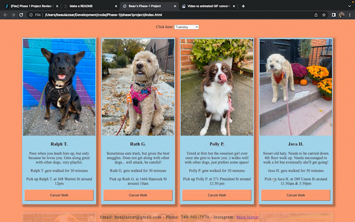

NAME

    Beau Lazear's Phase 1 project for the Flatiron School's software development program.

DESCRIPTION

    This application is made to help the independent dog walker stay organized. Dog data is stored in a local db.json file, and accessed by running a json-server in background. There is a select box, that lets you choose which day of the week you would like to view. Once a day is selected, all dogs scheduled to be walked that day will be displayed, along with the information needed to complete said walk. There is a form on the bottom of the page to submit a new dog to the database.

GIF

    

CONTACT

    Feel free to contact me if you have any questions regarding my project.
    beaulazear@gmail.com
    740-501-7570

GITHUB LINK

    https://github.com/beaulazear/phase1project.git

NOTICE

    For security reasons, addresses have been changed to ensure client privacy! One day, this could be recreated with a secured server.